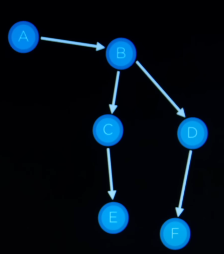

📘 Day 1 – AI/ML Journey
========================

CS50: Introduction to Artificial Intelligence — _Search_
--------------------------------------------------------

### 🔹 1. What is Search?

Search algorithms are widely used in real life — for example, **maps** use them to find the best path from a source to a destination.

A **search problem** can be described using the following components:

*   **Node** → The current object/state in the problem.
    
*   **Parent Node** → The node from which the current node was derived.
    
*   **State** → Describes the condition of the node.
    
*   **Action** → The operation taken to reach a new state.
    
*   **Goal State** → The target condition we want to achieve.
    
*   **Frontier** → A data structure holding the nodes to be explored.
    
*   **Explored Set** → A set of nodes that have already been visited (to avoid revisiting).
    

### 🔹 2. General Search Algorithm (Pseudocode)

1.  Start by adding the initial node to the **Frontier**.
    
2.  If the Frontier is empty → return “No Solution.”
    
3.  If the node is already in the **Explored Set** → skip it.
    
4.  Remove a node from the Frontier:
    
    *   If it is the **Goal State** → return solution.
        
    *   If not, expand the node and add its children to the Frontier.
        
5.  Add the removed node to the **Explored Set**.
    
6.  Repeat until the Goal is found or Frontier is empty.
    

### 🔹 3. Two Approaches to Search

Depending on how we choose nodes from the Frontier, we get two classical search strategies:

#### 3.1 Depth-First Search (DFS)

*   Uses a **Stack** (Last-In-First-Out).
    
*   Explores the deepest nodes first before backtracking.
    
*   Goes “down” one path completely before exploring others.
    

#### 3.2 Breadth-First Search (BFS)

*   Uses a **Queue** (First-In-First-Out).
    
*   Explores all nodes at the current depth before moving deeper.
    
*   Expands the search “level by level.”
    

### 🔹 4. Example — Finding E from A

#### Depth-First Search (DFS) Example:

1.  Start at **A** → not goal → move to **B**.
    
2.  **B** → not goal → expand → add **C, D**.
    
3.  Frontier is now \[C, D\]. Since DFS is LIFO, pick **D**.
    
4.  Expand **D** → add **F**.
    
5.  Continue → finally reach **E** via **C**.
    

**Summary:** DFS fully explores one path (depth) before backtracking.

#### Breadth-First Search (BFS) Example:

1.  Start at **A** → not goal → move to **B**.
    
2.  **B** → not goal → expand → add **C, D**.
    
3.  Frontier is \[C, D\]. BFS uses FIFO → pick **C**.
    
4.  Expand **C** → add **E**.
    
5.  Next node in queue is **E** → Goal found!
    

**Summary:** BFS explores nodes **level by level**, covering all branches of a depth before going deeper.

### 🔹 5. Key Takeaways from Day 1

*   Search problems consist of nodes, states, actions, goal states, frontier, and explored sets.
    
*   **DFS**: Stack-based, explores depth first.
    
*   **BFS**: Queue-based, explores breadth first.
    
*   BFS guarantees the shortest path (if all steps have equal cost), while DFS may find a solution faster but not necessarily optimal.
    

✅ **Reflection (Honest Work):**

*   I learned the **fundamentals of search problems** today.
    
*   Even though I didn’t cover much, I now understand how DFS and BFS differ in practice.
    
*   Tomorrow, I can extend this by coding a simple DFS and BFS in Python.
